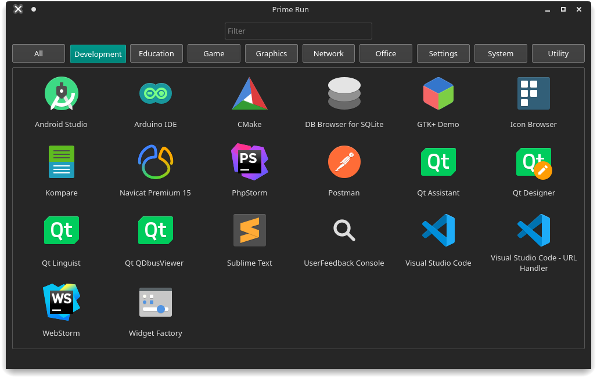

# prime-run

A simple python3 application developed using PyQt5 to run any installed application using prime-run. This application uses `Gio.AppInfo.get_all()` to list all installed application (.desktop files).

Know more about Prime [here](https://wiki.archlinux.org/index.php/PRIME).

Python Packages
---
* PyQt5 - https://pypi.org/project/PyQt5
* gi (Gio.AppInfo) - https://developer.gnome.org/pygobject/stable/class-gioappinfo.html

Authors
---
* [Souvik Hazra](https://github.com/souvikhazra1)

Tools
---
* Visual Studio Code - https://code.visualstudio.com
* Qt Designer (pyqt5-tools) - https://pypi.org/project/pyqt5-tools

Screenshot
---

Note
---
Main window has been designed using Qt Designer and `ui_main_window.py` is generated using:\
`pyuic5 main_window.ui -o ui_main_window.py`